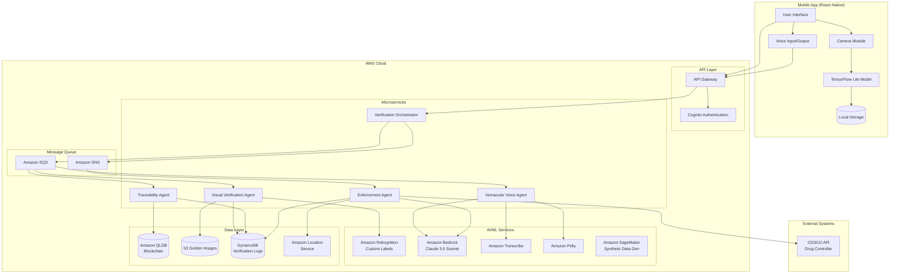
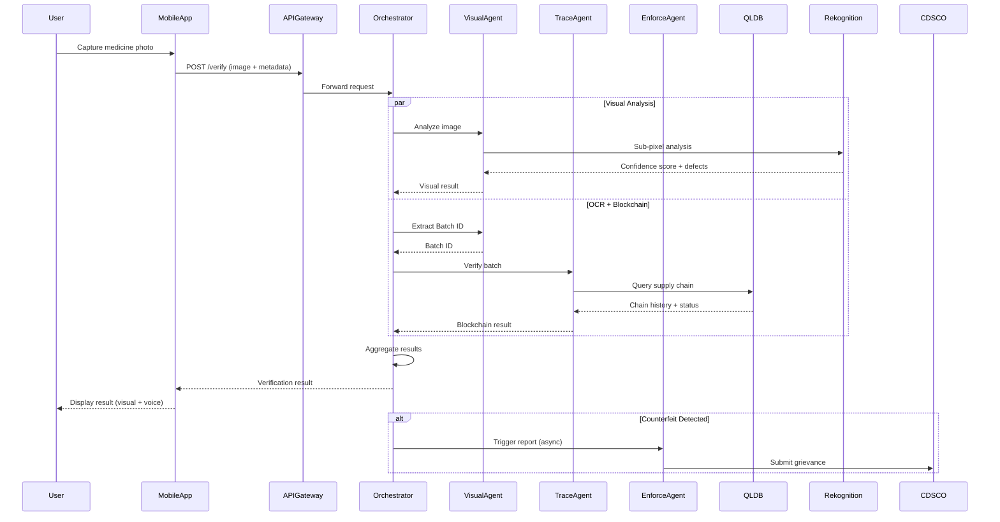
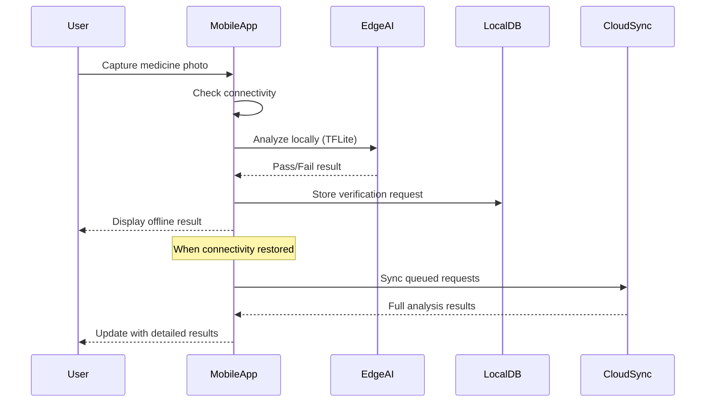
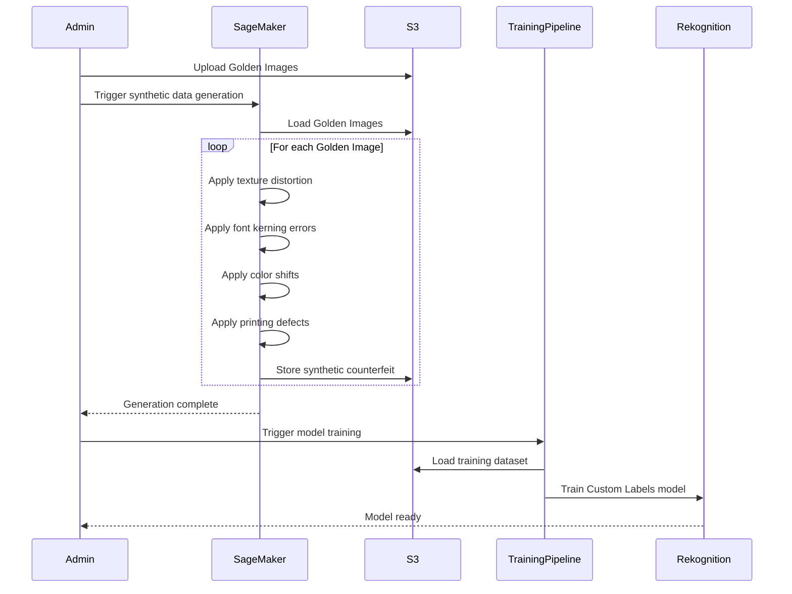

# Design Document: Aushadh-Verify

## Overview

Aushadh-Verify is an end-to-end Agentic AI solution that combines Physical AI, Digital Trust (blockchain), and Vernacular Voice interfaces to combat counterfeit medicines in rural India. The system is designed as a mobile-first application with a microservices backend architecture hosted on AWS.

The solution addresses three critical challenges:
1. **Sophisticated counterfeits** that fool simple QR code verification through sub-pixel texture analysis
2. **Low digital literacy** through vernacular voice interfaces (Hindi/Marathi)
3. **Limited connectivity** through offline Edge AI capabilities using TensorFlow Lite

The system orchestrates four autonomous agents:
- **Visual Verification Agent**: Analyzes packaging using Amazon Rekognition Custom Labels
- **Traceability Agent**: Validates supply chain through Amazon QLDB blockchain
- **Vernacular Voice Interface**: Provides voice interaction via Amazon Transcribe and Polly
- **Enforcement Agent**: Autonomously reports counterfeits to CDSCO with GPS location

## Architecture

### High-Level Architecture



### Microservices Architecture

The system follows a microservices pattern where each agent is an independent service:

1. **Verification Orchestrator Service**
   - Entry point for all verification requests
   - Coordinates workflow between agents
   - Aggregates results from multiple agents
   - Implements circuit breaker pattern for fault tolerance

2. **Visual Verification Agent Service**
   - Stateless service for image analysis
   - Integrates with Amazon Rekognition Custom Labels
   - Performs sub-pixel texture analysis
   - Scales horizontally based on image processing load

3. **Traceability Agent Service**
   - Queries Amazon QLDB for batch verification
   - Implements caching for frequently queried batches
   - Detects refilled bottle scenarios
   - Handles blockchain query failures gracefully

4. **Vernacular Voice Agent Service**
   - Processes voice input via Amazon Transcribe
   - Uses Amazon Bedrock for natural language understanding
   - Generates voice responses via Amazon Polly
   - Supports Hindi and Marathi languages

5. **Enforcement Agent Service**
   - Triggered asynchronously when counterfeits detected
   - Generates formal reports using Amazon Bedrock
   - Captures GPS location via Amazon Location Service
   - Submits to CDSCO API with retry logic

### Data Flow

#### Online Verification Flow



#### Offline Verification Flow



#### Synthetic Data Generation Flow



## Components and Interfaces

### Mobile Application (React Native)

**Purpose**: Cross-platform mobile app for iOS and Android targeting rural users with low digital literacy.

**Key Components**:
- **Camera Module**: Captures high-resolution images with real-time guidance overlay
- **TensorFlow Lite Integration**: Runs Edge AI model for offline verification
- **Voice Interface**: Records audio input and plays voice responses
- **Local Storage**: SQLite database for offline queue and user preferences
- **Sync Manager**: Handles background synchronization when connectivity restored

**Interfaces**:
```typescript
interface VerificationRequest {
  imageUri: string;
  timestamp: number;
  gpsLocation?: {
    latitude: number;
    longitude: number;
    accuracy: number;
  };
  userLanguage: 'hi' | 'mr'; // Hindi or Marathi
  offlineMode: boolean;
}

interface VerificationResponse {
  verificationId: string;
  result: 'authentic' | 'counterfeit' | 'suspicious' | 'inconclusive';
  confidence: number;
  visualAnalysis: {
    score: number;
    defectsDetected: MicroDefect[];
  };
  blockchainAnalysis?: {
    batchExists: boolean;
    supplyChainValid: boolean;
    recallStatus: string;
    suspiciousReason?: string;
  };
  recommendation: string;
  voiceMessageUrl?: string;
}

interface MicroDefect {
  type: 'texture' | 'font_kerning' | 'color' | 'printing';
  severity: number;
  location: {
    x: number;
    y: number;
    width: number;
    height: number;
  };
}
```

### API Gateway

**Purpose**: Single entry point for all mobile app requests with authentication and rate limiting.

**Endpoints**:
- `POST /api/v1/verify` - Submit verification request
- `POST /api/v1/voice/query` - Submit voice query
- `GET /api/v1/verify/{id}` - Get verification status
- `GET /api/v1/history` - Get user verification history
- `POST /api/v1/feedback` - Submit false positive feedback
- `GET /api/v1/edge-model` - Download latest TFLite model

**Authentication**: AWS Cognito with OTP-based phone number verification

### Verification Orchestrator Service

**Purpose**: Coordinates the verification workflow across multiple agents and aggregates results.

**Technology**: Node.js with TypeScript, deployed on AWS Lambda

**Key Responsibilities**:
- Receive verification requests from API Gateway
- Dispatch tasks to Visual and Traceability agents via SQS
- Implement timeout and circuit breaker patterns
- Aggregate results from multiple agents
- Determine final classification based on combined analysis
- Trigger Enforcement Agent for counterfeit detections
- Store verification logs in DynamoDB

**Interfaces**:
```typescript
interface OrchestrationContext {
  verificationId: string;
  imageS3Key: string;
  userMetadata: {
    userId: string;
    location?: GpsLocation;
    language: string;
  };
  visualResult?: VisualAnalysisResult;
  blockchainResult?: BlockchainAnalysisResult;
  startTime: number;
}

interface AggregatedResult {
  finalClassification: 'authentic' | 'counterfeit' | 'suspicious' | 'inconclusive';
  confidence: number;
  reasoning: string[];
  requiresEnforcement: boolean;
}
```

**Classification Logic**:
```
IF visual_score < 0.60 AND blockchain_invalid:
  RETURN 'counterfeit' (high confidence)

IF visual_score > 0.85 AND blockchain_valid AND NOT recalled:
  RETURN 'authentic' (high confidence)

IF visual_score > 0.85 AND blockchain_shows_recall:
  RETURN 'suspicious' (refilled bottle)

IF visual_score > 0.85 AND blockchain_shows_wrong_region:
  RETURN 'suspicious' (refilled bottle)

IF 0.60 <= visual_score <= 0.85:
  RETURN 'inconclusive' (recommend pharmacist consultation)

DEFAULT:
  RETURN 'inconclusive'
```

### Visual Verification Agent Service

**Purpose**: Performs sub-pixel analysis of medicine packaging using Amazon Rekognition Custom Labels.

**Technology**: Python 3.11, deployed on AWS Lambda with increased memory (3GB) and timeout (30s)

**Key Responsibilities**:
- Receive image analysis requests from SQS queue
- Validate image quality (resolution, focus, lighting)
- Call Amazon Rekognition Custom Labels for sub-pixel analysis
- Extract Batch ID using OCR (Amazon Textract)
- Detect micro-defects in texture and font kerning
- Return confidence score and detected defects

**Interfaces**:
```python
@dataclass
class VisualAnalysisRequest:
    verification_id: str
    image_s3_key: str
    medicine_type: Optional[str]

@dataclass
class VisualAnalysisResult:
    verification_id: str
    confidence_score: float  # 0.0 to 1.0
    micro_defects: List[MicroDefect]
    batch_id: Optional[str]
    processing_time_ms: int
    model_version: str

@dataclass
class ImageQualityCheck:
    is_valid: bool
    resolution: Tuple[int, int]
    brightness_score: float
    blur_score: float
    rejection_reason: Optional[str]
```

**Amazon Rekognition Custom Labels Integration**:
- Model trained on Golden Images + Synthetic Data from SageMaker
- Custom labels: `authentic`, `counterfeit_texture`, `counterfeit_font`, `counterfeit_color`
- Minimum confidence threshold: 60%
- Model versioning for A/B testing

**OCR for Batch ID Extraction**:
- Uses Amazon Textract for text detection
- Pattern matching for Indian pharmaceutical batch formats:
  - `BATCH: [A-Z0-9]{6,12}`
  - `MFG: [0-9]{2}/[0-9]{4}`
  - `EXP: [0-9]{2}/[0-9]{4}`

### Traceability Agent Service

**Purpose**: Validates medicine batch information against Amazon QLDB blockchain ledger.

**Technology**: Java 17 with Spring Boot, deployed on AWS ECS Fargate

**Key Responsibilities**:
- Receive batch verification requests from SQS queue
- Query Amazon QLDB for batch history
- Validate supply chain completeness
- Detect recall status and geographic anomalies
- Implement caching for frequently queried batches (Redis)
- Handle QLDB query failures with retry logic

**Interfaces**:
```java
public class BlockchainVerificationRequest {
    private String verificationId;
    private String batchId;
    private Optional<String> expectedRegion;
}

public class BlockchainVerificationResult {
    private String verificationId;
    private boolean batchExists;
    private boolean supplyChainValid;
    private BatchInfo batchInfo;
    private List<SupplyChainEvent> supplyChain;
    private RecallStatus recallStatus;
    private Optional<String> suspiciousReason;
}

public class BatchInfo {
    private String batchId;
    private String manufacturer;
    private LocalDate manufacturingDate;
    private LocalDate expiryDate;
    private String medicineName;
    private String dosageForm;
}

public class SupplyChainEvent {
    private String eventType; // MANUFACTURED, DISTRIBUTED, RECEIVED
    private Instant timestamp;
    private String location;
    private String organizationId;
    private String transactionHash;
}

public enum RecallStatus {
    NOT_RECALLED,
    RECALLED_SAFETY,
    RECALLED_QUALITY,
    RECALLED_EXPIRED
}
```

**QLDB Schema**:
```sql
-- Batches table
CREATE TABLE Batches (
    batchId STRING,
    manufacturer STRING,
    medicineName STRING,
    manufacturingDate DATE,
    expiryDate DATE,
    dosageForm STRING,
    recallStatus STRING,
    PRIMARY KEY (batchId)
)

-- SupplyChain table (immutable ledger)
CREATE TABLE SupplyChain (
    eventId STRING,
    batchId STRING,
    eventType STRING,
    timestamp TIMESTAMP,
    location STRING,
    organizationId STRING,
    previousEventId STRING,
    PRIMARY KEY (eventId)
)

-- Create index for fast batch lookup
CREATE INDEX ON Batches (batchId)
```

**Refilled Bottle Detection Logic**:
```java
public Optional<String> detectSuspiciousActivity(
    BatchInfo batch, 
    List<SupplyChainEvent> chain,
    String currentRegion
) {
    // Check recall status
    if (batch.getRecallStatus() != RecallStatus.NOT_RECALLED) {
        return Optional.of("Batch recalled: " + batch.getRecallStatus());
    }
    
    // Check geographic anomaly
    String lastDistributionRegion = chain.stream()
        .filter(e -> e.getEventType().equals("DISTRIBUTED"))
        .max(Comparator.comparing(SupplyChainEvent::getTimestamp))
        .map(SupplyChainEvent::getLocation)
        .orElse(null);
    
    if (lastDistributionRegion != null && 
        !lastDistributionRegion.equals(currentRegion)) {
        return Optional.of(
            "Geographic mismatch: distributed in " + lastDistributionRegion +
            " but found in " + currentRegion
        );
    }
    
    return Optional.empty();
}
```

### Vernacular Voice Agent Service

**Purpose**: Provides voice-based interaction in Hindi and Marathi for users with low digital literacy.

**Technology**: Python 3.11, deployed on AWS Lambda

**Key Responsibilities**:
- Transcribe voice input using Amazon Transcribe
- Process natural language queries using Amazon Bedrock (Claude 3.5 Sonnet)
- Generate contextual responses with medical verification context
- Synthesize voice output using Amazon Polly
- Apply guardrails to prevent medical advice beyond verification

**Interfaces**:
```python
@dataclass
class VoiceQueryRequest:
    verification_id: str
    audio_s3_key: str
    language: str  # 'hi' or 'mr'
    verification_context: Optional[VerificationResponse]

@dataclass
class VoiceQueryResponse:
    transcribed_text: str
    response_text: str
    audio_response_s3_key: str
    language: str
    guardrail_triggered: bool
```

**Amazon Transcribe Configuration**:
- Language models: `hi-IN` (Hindi), `mr-IN` (Marathi)
- Custom vocabulary for pharmaceutical terms
- Real-time streaming for low latency

**Amazon Bedrock Integration**:
```python
def generate_voice_response(
    transcribed_query: str,
    verification_result: VerificationResponse,
    language: str
) -> str:
    prompt = f"""You are a medicine verification assistant speaking to a rural user in India.
    
User query: {transcribed_query}
Verification result: {verification_result.result}
Confidence: {verification_result.confidence}

Respond in {language} language with:
1. Simple, clear language (avoid technical terms)
2. Direct answer about medicine authenticity
3. Recommended action (use/don't use/consult pharmacist)

IMPORTANT GUARDRAILS:
- Only discuss medicine authenticity verification
- Do NOT provide medical advice about treatment
- Do NOT recommend dosage or usage instructions
- Do NOT diagnose conditions

Response:"""

    response = bedrock_client.invoke_model(
        modelId="anthropic.claude-3-5-sonnet-20241022-v2:0",
        body={
            "prompt": prompt,
            "max_tokens": 200,
            "temperature": 0.3,
            "guardrailIdentifier": "aushadh-verify-guardrail",
            "guardrailVersion": "1"
        }
    )
    
    return response['completion']
```

**Amazon Bedrock Guardrails Configuration**:
```yaml
guardrails:
  - name: "aushadh-verify-guardrail"
    denied_topics:
      - "Medical treatment advice"
      - "Dosage recommendations"
      - "Disease diagnosis"
      - "Drug interactions"
    content_filters:
      - type: "MEDICAL_ADVICE"
        threshold: "HIGH"
    word_filters:
      - "take this medicine"
      - "recommended dosage"
      - "you should consume"
```

**Amazon Polly Configuration**:
- Hindi voice: `Aditi` (female, Indian accent)
- Marathi voice: `Aditi` (supports Marathi with Indian accent)
- Speech rate: 90% (slower for clarity)
- Output format: MP3, 24kbps

### Enforcement Agent Service

**Purpose**: Autonomously generates and submits counterfeit detection reports to CDSCO.

**Technology**: Python 3.11, deployed on AWS Lambda

**Key Responsibilities**:
- Triggered asynchronously via SNS when counterfeits detected
- Capture GPS location using Amazon Location Service
- Generate formal grievance report using Amazon Bedrock
- Submit to CDSCO API with retry logic
- Store submission receipts in DynamoDB

**Interfaces**:
```python
@dataclass
class EnforcementTrigger:
    verification_id: str
    verification_result: VerificationResponse
    user_location: Optional[GpsLocation]
    pharmacy_details: Optional[PharmacyInfo]
    evidence_images: List[str]  # S3 keys

@dataclass
class GrievanceReport:
    report_id: str
    verification_id: str
    batch_id: Optional[str]
    medicine_name: str
    detection_timestamp: datetime
    gps_location: GpsLocation
    pharmacy_details: Optional[PharmacyInfo]
    evidence_urls: List[str]
    visual_defects: List[MicroDefect]
    blockchain_anomalies: List[str]
    formal_description: str  # Generated by Bedrock

@dataclass
class CDSCOSubmissionResult:
    success: bool
    submission_id: Optional[str]
    submission_timestamp: Optional[datetime]
    retry_count: int
    error_message: Optional[str]
```

**Report Generation with Amazon Bedrock**:
```python
def generate_formal_grievance(
    verification_result: VerificationResponse,
    location: GpsLocation,
    pharmacy: Optional[PharmacyInfo]
) -> str:
    prompt = f"""Generate a formal grievance report for the Central Drugs Standard Control Organization (CDSCO) regarding a suspected counterfeit medicine.

Details:
- Medicine: {verification_result.medicine_name}
- Batch ID: {verification_result.batch_id}
- Detection Date: {datetime.now().isoformat()}
- Location: Lat {location.latitude}, Lon {location.longitude}
- Visual Defects: {verification_result.visual_analysis.defects_detected}
- Blockchain Issues: {verification_result.blockchain_analysis.suspicious_reason}

Generate a formal report in English following CDSCO format with:
1. Subject line
2. Detailed description of counterfeit indicators
3. Evidence summary
4. Recommended enforcement action

Report:"""

    response = bedrock_client.invoke_model(
        modelId="anthropic.claude-3-5-sonnet-20241022-v2:0",
        body={
            "prompt": prompt,
            "max_tokens": 500,
            "temperature": 0.2
        }
    )
    
    return response['completion']
```

**CDSCO API Integration**:
```python
def submit_to_cdsco(report: GrievanceReport) -> CDSCOSubmissionResult:
    """
    Submit grievance to CDSCO API with exponential backoff retry.
    """
    max_retries = 3
    retry_count = 0
    
    while retry_count < max_retries:
        try:
            response = requests.post(
                url="https://api.cdsco.gov.in/v1/grievances",
                headers={
                    "Authorization": f"Bearer {get_cdsco_token()}",
                    "Content-Type": "application/json"
                },
                json={
                    "reportType": "COUNTERFEIT_MEDICINE",
                    "batchId": report.batch_id,
                    "medicineName": report.medicine_name,
                    "location": {
                        "latitude": report.gps_location.latitude,
                        "longitude": report.gps_location.longitude
                    },
                    "description": report.formal_description,
                    "evidenceUrls": report.evidence_urls,
                    "submittedBy": "AUSHADH_VERIFY_SYSTEM"
                },
                timeout=10
            )
            
            if response.status_code == 201:
                return CDSCOSubmissionResult(
                    success=True,
                    submission_id=response.json()['grievanceId'],
                    submission_timestamp=datetime.now(),
                    retry_count=retry_count
                )
            
        except Exception as e:
            retry_count += 1
            if retry_count < max_retries:
                time.sleep(2 ** retry_count)  # Exponential backoff
            else:
                return CDSCOSubmissionResult(
                    success=False,
                    retry_count=retry_count,
                    error_message=str(e)
                )
    
    return CDSCOSubmissionResult(success=False, retry_count=max_retries)
```

### Edge AI Model (TensorFlow Lite)

**Purpose**: Lightweight model for offline verification on mobile devices in digital deserts.

**Technology**: TensorFlow Lite, quantized INT8 model

**Model Architecture**:
- Base: MobileNetV3-Small (optimized for mobile)
- Input: 224x224 RGB image
- Output: Binary classification (Pass/Fail) + confidence
- Model size: <10MB (compressed)
- Inference time: <2 seconds on mid-range Android devices

**Training Pipeline**:
1. Train full model on AWS SageMaker using Golden Images + Synthetic Data
2. Achieve >90% accuracy on validation set
3. Quantize to INT8 using TensorFlow Lite converter
4. Validate quantized model maintains >85% accuracy
5. Deploy to S3 for mobile app download

**Limitations of Offline Mode**:
- No sub-pixel analysis (simplified texture check only)
- No blockchain verification
- No batch ID extraction
- Higher false negative rate acceptable (safety first)
- Results marked as "preliminary" requiring online sync

**Model Update Strategy**:
- Check for updates weekly when connected
- Download in background over WiFi only
- Validate model signature before replacing
- Rollback mechanism if new model performs poorly

## Data Models

### Verification Record

```typescript
interface VerificationRecord {
  verificationId: string;
  userId: string;
  timestamp: number;
  
  // Input data
  imageS3Key: string;
  gpsLocation?: GpsLocation;
  userLanguage: string;
  offlineMode: boolean;
  
  // Analysis results
  visualAnalysis: {
    confidence: number;
    microDefects: MicroDefect[];
    batchId?: string;
    modelVersion: string;
    processingTimeMs: number;
  };
  
  blockchainAnalysis?: {
    batchExists: boolean;
    supplyChainValid: boolean;
    batchInfo?: BatchInfo;
    recallStatus: string;
    suspiciousReason?: string;
    processingTimeMs: number;
  };
  
  // Final result
  finalClassification: 'authentic' | 'counterfeit' | 'suspicious' | 'inconclusive';
  aggregatedConfidence: number;
  reasoning: string[];
  
  // Enforcement
  enforcementTriggered: boolean;
  enforcementReportId?: string;
  
  // User feedback
  userFeedback?: {
    reportedIncorrect: boolean;
    feedbackText?: string;
    feedbackTimestamp: number;
  };
}
```

### Golden Image Metadata

```typescript
interface GoldenImageMetadata {
  imageId: string;
  s3Key: string;
  medicineName: string;
  manufacturer: string;
  dosageForm: string;
  packagingType: string;
  
  // Image characteristics
  resolution: {
    width: number;
    height: number;
  };
  captureDate: number;
  captureDevice: string;
  
  // Extracted features
  textureFeatures: number[]; // Feature vector from Rekognition
  colorHistogram: number[];
  fontCharacteristics: {
    fontFamily: string;
    averageKerning: number;
    textLocations: BoundingBox[];
  };
  
  // Versioning
  version: number;
  isActive: boolean;
  replacedBy?: string; // imageId of newer version
}
```

### Synthetic Training Sample

```typescript
interface SyntheticTrainingSample {
  sampleId: string;
  s3Key: string;
  sourceGoldenImageId: string;
  generationTimestamp: number;
  
  // Applied transformations
  appliedDefects: {
    type: 'texture' | 'font_kerning' | 'color' | 'printing';
    severity: number; // 0.0 to 1.0
    parameters: Record<string, any>;
  }[];
  
  // Labels
  label: 'counterfeit';
  defectLocations: BoundingBox[];
  
  // Quality metrics
  realismScore: number; // How realistic the synthetic defect looks
  usedInTraining: boolean;
  modelVersion: string;
}
```

### User Profile

```typescript
interface UserProfile {
  userId: string;
  phoneNumber: string; // Hashed
  registrationDate: number;
  
  // Preferences
  preferredLanguage: 'hi' | 'mr';
  notificationsEnabled: boolean;
  
  // Usage statistics
  totalVerifications: number;
  counterfeitDetections: number;
  lastVerificationDate: number;
  
  // Privacy
  dataRetentionConsent: boolean;
  locationSharingEnabled: boolean;
  
  // Role (for future expansion)
  role: 'patient' | 'pharmacist' | 'healthcare_worker';
  pharmacyId?: string;
}
```

### Pharmacy Information

```typescript
interface PharmacyInfo {
  pharmacyId: string;
  name: string;
  licenseNumber: string;
  
  // Location
  address: string;
  city: string;
  state: string;
  pincode: string;
  gpsLocation: GpsLocation;
  
  // Contact
  phoneNumber: string;
  ownerName: string;
  
  // Statistics
  totalVerifications: number;
  counterfeitDetections: number;
  lastVerificationDate: number;
}
```

### GPS Location

```typescript
interface GpsLocation {
  latitude: number;
  longitude: number;
  accuracy: number; // meters
  timestamp: number;
  source: 'gps' | 'network' | 'last_known';
}
```

### Bounding Box

```typescript
interface BoundingBox {
  x: number;
  y: number;
  width: number;
  height: number;
}
```


## Correctness Properties

*A property is a characteristic or behavior that should hold true across all valid executions of a system—essentially, a formal statement about what the system should do. Properties serve as the bridge between human-readable specifications and machine-verifiable correctness guarantees.*

### Visual Verification Properties

**Property 1: Image format and resolution validation**
*For any* image submitted to the Visual Verification Agent, if the image format is JPEG, PNG, or HEIC and resolution is at least 1920x1080 pixels, then the agent should accept it; otherwise it should reject it with specific feedback about the validation failure.
**Validates: Requirements 1.1, 1.9**

**Property 2: Confidence score bounds**
*For any* image analysis performed by the Visual Verification Agent, the generated confidence score must be between 0.0 and 1.0 inclusive.
**Validates: Requirements 1.5**

**Property 3: Confidence-based classification**
*For any* verification result with a confidence score, the system should classify as authentic when score > 0.85, counterfeit when score < 0.60, and inconclusive when 0.60 ≤ score ≤ 0.85.
**Validates: Requirements 1.6, 1.7, 1.8**

**Property 4: Micro-defect detection with synthetic data**
*For any* synthetic training image with known defects (texture irregularities, font spacing errors, color inconsistencies), the Visual Verification Agent should detect those defects when analyzing the image.
**Validates: Requirements 1.3, 8.2, 8.3**

**Property 5: Performance bounds for online analysis**
*For any* image submitted in online mode, the Visual Verification Agent should complete texture analysis within 5 seconds.
**Validates: Requirements 1.4**

### Batch ID Extraction Properties

**Property 6: Batch ID pattern matching**
*For any* image containing text matching Indian pharmaceutical batch ID formats (BATCH: [A-Z0-9]{6,12}), the system should successfully extract and identify the Batch ID.
**Validates: Requirements 2.2, 2.3**

**Property 7: Batch ID format validation**
*For any* extracted Batch ID, the system should validate the format matches expected patterns before querying the blockchain.
**Validates: Requirements 2.5**

**Property 8: Batch ID extraction error handling**
*For any* image where Batch ID extraction fails, the system should return an error indicating manual entry is required.
**Validates: Requirements 2.4**

### Blockchain Verification Properties

**Property 9: Blockchain query performance**
*For any* valid Batch ID, the Traceability Agent should complete the QLDB query within 3 seconds.
**Validates: Requirements 3.1**

**Property 10: Blockchain data completeness**
*For any* successful blockchain query, the retrieved data must include manufacturing date, manufacturer identity, distribution chain records, and recall status.
**Validates: Requirements 3.2**

**Property 11: Supply chain validation**
*For any* retrieved supply chain, the Traceability Agent should verify completeness by checking that each distribution event has a corresponding previous event (except the manufacturing event).
**Validates: Requirements 3.3**

**Property 12: Non-existent batch detection**
*For any* Batch ID that does not exist in the QLDB ledger, the Traceability Agent should flag the medicine as potentially counterfeit.
**Validates: Requirements 3.4**

**Property 13: Supply chain anomaly detection**
*For any* supply chain with missing events, timestamp inconsistencies, or broken links, the Traceability Agent should flag specific discrepancies.
**Validates: Requirements 3.5**

**Property 14: Refilled bottle detection - recall status**
*For any* verification where visual confidence > 0.85 (authentic texture) AND blockchain shows recall status != NOT_RECALLED, the system should classify as "Suspicious (Refilled Bottle)".
**Validates: Requirements 3.6**

**Property 15: Refilled bottle detection - geographic mismatch**
*For any* verification where visual confidence > 0.85 (authentic texture) AND blockchain shows last distribution region != current region, the system should classify as "Suspicious (Refilled Bottle)".
**Validates: Requirements 3.7**

**Property 16: Result aggregation**
*For any* verification with both visual and blockchain results, the system should combine them using the classification logic to produce a final result that considers both analyses.
**Validates: Requirements 3.8**

### Offline Mode Properties

**Property 17: Automatic offline mode switching**
*For any* verification request when internet connectivity is unavailable, the system should automatically switch to Offline Mode and use the local TensorFlow Lite model.
**Validates: Requirements 4.2, 4.3**

**Property 18: Offline verification queue**
*For any* verification performed in Offline Mode, the system should store the request (image + metadata) in a local queue for later synchronization.
**Validates: Requirements 4.5**

**Property 19: Offline-to-online synchronization**
*For any* queued offline verification, when internet connectivity is restored, the system should synchronize it with the cloud backend for full analysis.
**Validates: Requirements 4.6**

**Property 20: Offline mode indicator**
*For any* verification in Offline Mode, the system should display an indicator that blockchain verification and sub-pixel analysis are unavailable.
**Validates: Requirements 4.7**

**Property 21: Offline verification performance**
*For any* verification in Offline Mode, the Edge AI model should provide results within 8 seconds.
**Validates: Requirements 4.8**

**Property 22: Edge model auto-update**
*For any* Edge AI model that is outdated (version < latest), when connectivity is available, the system should automatically download and update to the latest version.
**Validates: Requirements 4.9**

### Enforcement Reporting Properties

**Property 23: Automatic enforcement triggering**
*For any* verification classified as counterfeit, the Enforcement Agent should automatically initiate report generation.
**Validates: Requirements 5.1**

**Property 24: Enforcement report completeness**
*For any* generated enforcement report, it must include Batch ID, verification timestamp, GPS location, pharmacy details, evidence images, visual defects, and blockchain anomalies.
**Validates: Requirements 5.3, 9.2**

**Property 25: CDSCO submission with retry**
*For any* enforcement report, the system should attempt submission to CDSCO API, and if it fails, retry up to 3 times with exponential backoff (2^retry_count seconds).
**Validates: Requirements 5.5, 5.7**

**Property 26: Failed submission handling**
*For any* enforcement report where all 3 retry attempts fail, the system should queue the report for manual review and notify administrators.
**Validates: Requirements 5.8**

**Property 27: Submission receipt storage**
*For any* successful CDSCO submission, the system should store a confirmation receipt with submission timestamp and reference number.
**Validates: Requirements 5.6**

**Property 28: GPS fallback**
*For any* enforcement report where current GPS location is unavailable, the system should use the last known location with a timestamp indicating staleness.
**Validates: Requirements 5.9**

### Voice Interface Properties

**Property 29: Multi-language voice support**
*For any* voice query in Hindi or Marathi, the Vernacular Voice Interface should successfully transcribe it using Amazon Transcribe with the appropriate language model.
**Validates: Requirements 6.2**

**Property 30: Voice query processing**
*For any* transcribed query equivalent to "Is this real?" in Hindi or Marathi, the system should process it and provide verification results.
**Validates: Requirements 6.3**

**Property 31: Counterfeit voice warning**
*For any* counterfeit detection, the system should generate a voice warning using Amazon Polly that states the medicine is fake and should not be consumed.
**Validates: Requirements 6.5**

**Property 32: Voice output language selection**
*For any* voice output, the system should use the user's selected language (Hindi or Marathi), defaulting to Hindi if no preference is set.
**Validates: Requirements 6.6, 6.7**

**Property 33: Voice content completeness**
*For any* voice warning, the output should include medicine name, verification result, and recommended action in simple language.
**Validates: Requirements 6.8**

**Property 34: Voice replay availability**
*For any* completed voice output, the system should provide an option to replay the warning.
**Validates: Requirements 6.9**

**Property 35: Language preference persistence**
*For any* user who sets a language preference, that preference should be stored and retrieved in future sessions.
**Validates: Requirements 6.10**

### Golden Image Management Properties

**Property 36: Golden image upload authorization**
*For any* Golden Image upload attempt, the system should allow it only if the user has administrator authorization; otherwise reject it.
**Validates: Requirements 7.1**

**Property 37: Golden image quality validation**
*For any* uploaded Golden Image, the system should validate image quality and resolution requirements before accepting it.
**Validates: Requirements 7.2**

**Property 38: Golden image feature extraction**
*For any* successfully uploaded Golden Image, the system should extract and store texture features for future comparison.
**Validates: Requirements 7.3**

**Property 39: Golden image versioning**
*For any* medicine with multiple uploaded images, the system should maintain version history linking newer versions to older ones.
**Validates: Requirements 7.4**

### Synthetic Data Generation Properties

**Property 40: Synthetic defect variety**
*For any* synthetic data generation run, the system should apply all defect types (texture distortion, font kerning errors, color shifts, printing defects) across the generated dataset.
**Validates: Requirements 8.2**

**Property 41: Synthetic data labeling**
*For any* generated synthetic image, the system should label it with defect type, severity, and location metadata.
**Validates: Requirements 8.4**

**Property 42: Training dataset balance**
*For any* completed synthetic dataset, the ratio of authentic to counterfeit samples should be at least 1:1.
**Validates: Requirements 8.5**

**Property 43: Training data composition**
*For any* model training run, the training dataset should include both real Golden Images and Synthetic Data.
**Validates: Requirements 8.6**

**Property 44: Synthetic data realism**
*For any* generated synthetic image, the realism score (measuring how realistic the defects appear) should exceed a minimum threshold (e.g., 0.7).
**Validates: Requirements 8.7**

### AI Guardrails Properties

**Property 45: Secondary verification requirement**
*For any* verification with confidence below the authentic threshold (< 0.85), the system should require secondary verification before final classification.
**Validates: Requirements 9.1**

**Property 46: False positive logging**
*For any* user-reported false positive, the system should log the feedback with associated images for model improvement.
**Validates: Requirements 9.3**

**Property 47: False positive rate monitoring**
*For any* 30-day period where the false positive rate exceeds 5%, the system should alert administrators for model review.
**Validates: Requirements 9.4**

**Property 48: Confidence communication**
*For any* displayed verification result, the system should clearly communicate confidence levels and uncertainty.
**Validates: Requirements 9.5**

**Property 49: Inconclusive result recommendation**
*For any* inconclusive verification result, the system should recommend consulting a qualified pharmacist rather than making a definitive claim.
**Validates: Requirements 9.6**

**Property 50: Out-of-scope query handling**
*For any* user query asking medical questions unrelated to verification (treatment, dosage, diagnosis), the system should respond that it only verifies authenticity and cannot provide medical advice.
**Validates: Requirements 9.8**

**Property 51: Medical advice prevention**
*For any* generated voice or text response, the content should not contain definitive medical claims about drug efficacy or treatment recommendations.
**Validates: Requirements 9.9**

### Security and Privacy Properties

**Property 52: OTP authentication**
*For any* authentication request, the system should support OTP-based login flow with phone number verification.
**Validates: Requirements 10.2**

**Property 53: Data encryption at rest**
*For any* stored user data containing personally identifiable information, the data should be encrypted at rest.
**Validates: Requirements 10.3**

**Property 54: TLS transport security**
*For any* network communication, the system should use TLS 1.3 or higher.
**Validates: Requirements 10.4**

**Property 55: Enforcement report access control**
*For any* access attempt to enforcement reports, the system should grant access only to authorized CDSCO personnel.
**Validates: Requirements 10.5**

**Property 56: Data deletion with anonymization**
*For any* user data deletion request, the system should remove personal data within 30 days while retaining anonymized verification statistics.
**Validates: Requirements 10.6**

### Monitoring Properties

**Property 57: Verification logging**
*For any* verification request, the system should log it with timestamp and result.
**Validates: Requirements 11.1**

**Property 58: Performance degradation alerting**
*For any* verification request with response time exceeding 10 seconds, the system should alert administrators.
**Validates: Requirements 11.2**

**Property 59: Model accuracy monitoring**
*For any* period where Edge AI model accuracy drops below 90%, the system should trigger a model retraining workflow.
**Validates: Requirements 11.3**

**Property 60: Metrics tracking**
*For any* operational day, the system should track daily verification volume, success rates, and counterfeit detection rates.
**Validates: Requirements 11.4**

### User Interface Properties

**Property 61: Real-time capture guidance**
*For any* image capture session, the system should provide real-time guidance for proper photo alignment and lighting.
**Validates: Requirements 12.2**

**Property 62: Progress indication**
*For any* verification in progress, the system should display a clear progress indicator.
**Validates: Requirements 12.3**

**Property 63: Color-coded result display**
*For any* verification result, the system should use the correct color indicator: green for authentic, red for counterfeit, yellow for inconclusive, orange for suspicious.
**Validates: Requirements 12.4**

**Property 64: Contextual help availability**
*For any* user requesting help, the system should provide contextual help text in the user's selected language.
**Validates: Requirements 12.6**

### Microservices Architecture Properties

**Property 65: Asynchronous inter-service communication**
*For any* communication between microservices, the system should use asynchronous message queues (SQS) rather than synchronous calls.
**Validates: Requirements 13.2**

**Property 66: API gateway orchestration**
*For any* verification request, the system should orchestrate multiple agents through the API gateway rather than direct service-to-service calls.
**Validates: Requirements 13.3**

**Property 67: Fault isolation**
*For any* microservice failure, the system should isolate the failure and continue operating with degraded functionality rather than complete system failure.
**Validates: Requirements 13.4**

**Property 68: Independent health monitoring**
*For any* microservice, the system should provide a separate health check endpoint that can be monitored independently.
**Validates: Requirements 13.6**


## Error Handling

### Error Categories

The system handles errors across multiple categories with specific strategies for each:

#### 1. Input Validation Errors

**Scenarios**:
- Invalid image format or resolution
- Poor image quality (blur, lighting)
- Missing or malformed Batch ID
- Invalid user authentication

**Handling Strategy**:
- Reject input immediately with specific, actionable feedback
- Provide guidance on how to correct the issue
- Log validation failures for monitoring
- Do not retry automatically (user must correct input)

**Example Response**:
```json
{
  "error": "IMAGE_QUALITY_INSUFFICIENT",
  "message": "Image is too blurry for analysis",
  "guidance": "Hold the camera steady and ensure good lighting",
  "retryable": true,
  "userAction": "RECAPTURE_IMAGE"
}
```

#### 2. External Service Failures

**Scenarios**:
- Amazon Rekognition timeout or error
- Amazon QLDB unavailable
- Amazon Bedrock rate limit exceeded
- CDSCO API down

**Handling Strategy**:
- Implement circuit breaker pattern (fail fast after threshold)
- Retry with exponential backoff (max 3 attempts)
- Degrade gracefully (e.g., skip blockchain if QLDB down)
- Queue for later processing if critical (enforcement reports)
- Alert administrators for prolonged outages

**Circuit Breaker Configuration**:
```typescript
interface CircuitBreakerConfig {
  failureThreshold: 5;        // Open after 5 failures
  successThreshold: 2;        // Close after 2 successes
  timeout: 30000;             // 30 second timeout
  resetTimeout: 60000;        // Try again after 1 minute
}
```

#### 3. Data Inconsistency Errors

**Scenarios**:
- Blockchain data incomplete or corrupted
- Golden Image missing for medicine type
- Conflicting results from visual and blockchain analysis

**Handling Strategy**:
- Return "inconclusive" result with explanation
- Log inconsistency for investigation
- Recommend manual verification by pharmacist
- Do not make definitive claims when data is uncertain

**Example**:
```typescript
if (visualResult.confidence > 0.85 && !blockchainResult.batchExists) {
  return {
    result: 'inconclusive',
    reason: 'Visual analysis suggests authentic, but batch not found in blockchain',
    recommendation: 'Consult pharmacist for manual verification',
    confidence: 0.5
  };
}
```

#### 4. Performance Degradation

**Scenarios**:
- High load causing slow response times
- Large image processing delays
- Database query timeouts

**Handling Strategy**:
- Set aggressive timeouts (5s for visual, 3s for blockchain)
- Return partial results if some agents timeout
- Scale horizontally (auto-scaling groups)
- Shed load if necessary (rate limiting)
- Alert administrators when SLA breached

**Timeout Handling**:
```typescript
const results = await Promise.race([
  Promise.all([visualAnalysis(), blockchainVerification()]),
  timeout(8000) // Overall timeout
]);

if (!results.visual) {
  // Visual agent timed out, use offline model result if available
  results.visual = await fallbackToOfflineModel();
}
```

#### 5. Offline Mode Limitations

**Scenarios**:
- No internet connectivity
- Edge model outdated
- Local storage full

**Handling Strategy**:
- Clearly communicate limitations to user
- Provide best-effort result with caveats
- Queue for full analysis when online
- Manage local storage (delete old queued items if full)
- Sync automatically when connectivity restored

**User Communication**:
```
"Offline Mode: Basic verification only. 
Result: PASS (preliminary)
This result will be confirmed with full analysis when you're back online."
```

#### 6. Security and Privacy Errors

**Scenarios**:
- Unauthorized access attempt
- Invalid authentication token
- Data encryption failure
- Privacy violation attempt

**Handling Strategy**:
- Reject immediately with generic error (don't leak info)
- Log security events for audit
- Rate limit authentication attempts
- Alert security team for suspicious patterns
- Fail closed (deny access on error)

### Error Response Format

All errors follow a consistent format:

```typescript
interface ErrorResponse {
  error: string;              // Error code (e.g., "IMAGE_QUALITY_INSUFFICIENT")
  message: string;            // Human-readable message
  guidance?: string;          // How to fix the issue
  retryable: boolean;         // Can the user retry?
  userAction?: string;        // Recommended action
  technicalDetails?: string;  // For debugging (admin only)
  timestamp: number;
  requestId: string;          // For support tracking
}
```

### Graceful Degradation Strategy

The system prioritizes availability over completeness:

1. **Visual-only mode**: If blockchain unavailable, provide visual analysis only
2. **Blockchain-only mode**: If Rekognition unavailable, use blockchain + offline model
3. **Offline mode**: If cloud unavailable, use local TensorFlow Lite model
4. **Read-only mode**: If database writes fail, continue serving reads

**Degradation Priority**:
```
Full Analysis (Visual + Blockchain) 
  ↓ (if blockchain fails)
Visual Analysis Only
  ↓ (if Rekognition fails)
Offline Model Analysis
  ↓ (if offline model fails)
Error with guidance to retry
```

## Testing Strategy

### Dual Testing Approach

The system requires both unit testing and property-based testing for comprehensive coverage:

- **Unit tests**: Verify specific examples, edge cases, and error conditions
- **Property tests**: Verify universal properties across all inputs

Together, these approaches provide comprehensive coverage where unit tests catch concrete bugs and property tests verify general correctness.

### Property-Based Testing

**Framework**: We will use **fast-check** for TypeScript/JavaScript services and **Hypothesis** for Python services.

**Configuration**:
- Minimum 100 iterations per property test (due to randomization)
- Each property test must reference its design document property
- Tag format: `Feature: aushadh-verify, Property {number}: {property_text}`

**Example Property Test (TypeScript with fast-check)**:

```typescript
import fc from 'fast-check';

describe('Visual Verification Agent', () => {
  // Feature: aushadh-verify, Property 2: Confidence score bounds
  it('should always generate confidence scores between 0.0 and 1.0', () => {
    fc.assert(
      fc.asyncProperty(
        fc.uint8Array({ minLength: 1000, maxLength: 10000 }), // Random image data
        async (imageData) => {
          const result = await visualAgent.analyze(imageData);
          expect(result.confidence).toBeGreaterThanOrEqual(0.0);
          expect(result.confidence).toBeLessThanOrEqual(1.0);
        }
      ),
      { numRuns: 100 }
    );
  });

  // Feature: aushadh-verify, Property 3: Confidence-based classification
  it('should classify based on confidence thresholds', () => {
    fc.assert(
      fc.property(
        fc.float({ min: 0.0, max: 1.0 }), // Random confidence score
        (confidence) => {
          const classification = classifyByConfidence(confidence);
          
          if (confidence > 0.85) {
            expect(classification).toBe('authentic');
          } else if (confidence < 0.60) {
            expect(classification).toBe('counterfeit');
          } else {
            expect(classification).toBe('inconclusive');
          }
        }
      ),
      { numRuns: 100 }
    );
  });
});
```

**Example Property Test (Python with Hypothesis)**:

```python
from hypothesis import given, strategies as st
import pytest

class TestTraceabilityAgent:
    # Feature: aushadh-verify, Property 11: Supply chain validation
    @given(st.lists(
        st.builds(SupplyChainEvent,
                  event_type=st.sampled_from(['MANUFACTURED', 'DISTRIBUTED', 'RECEIVED']),
                  timestamp=st.datetimes(),
                  location=st.text(min_size=1, max_size=50)),
        min_size=2,
        max_size=20
    ))
    def test_supply_chain_completeness(self, events):
        """For any supply chain, each event (except manufacturing) should have a previous event"""
        agent = TraceabilityAgent()
        
        # Sort events by timestamp
        sorted_events = sorted(events, key=lambda e: e.timestamp)
        
        # Link events
        for i in range(1, len(sorted_events)):
            sorted_events[i].previous_event_id = sorted_events[i-1].event_id
        
        result = agent.validate_supply_chain(sorted_events)
        
        # Should be valid since we properly linked them
        assert result.is_valid == True
        assert result.has_broken_links == False
```

### Unit Testing Strategy

Unit tests focus on specific examples, edge cases, and integration points:

**Coverage Areas**:

1. **API Endpoints**: Test request/response handling, authentication, validation
2. **Service Integration**: Test calls to AWS services with mocked responses
3. **Business Logic**: Test classification rules, aggregation logic, retry mechanisms
4. **Edge Cases**: Test boundary conditions, empty inputs, malformed data
5. **Error Handling**: Test each error scenario with expected responses

**Example Unit Tests**:

```typescript
describe('Enforcement Agent', () => {
  describe('CDSCO Submission', () => {
    it('should submit report successfully on first attempt', async () => {
      const mockCDSCO = jest.fn().mockResolvedValue({
        status: 201,
        data: { grievanceId: 'GRV-12345' }
      });
      
      const result = await enforcementAgent.submitToCDSCO(mockReport);
      
      expect(result.success).toBe(true);
      expect(result.submissionId).toBe('GRV-12345');
      expect(result.retryCount).toBe(0);
      expect(mockCDSCO).toHaveBeenCalledTimes(1);
    });

    it('should retry 3 times with exponential backoff on failure', async () => {
      const mockCDSCO = jest.fn()
        .mockRejectedValueOnce(new Error('Network error'))
        .mockRejectedValueOnce(new Error('Network error'))
        .mockRejectedValueOnce(new Error('Network error'));
      
      const result = await enforcementAgent.submitToCDSCO(mockReport);
      
      expect(result.success).toBe(false);
      expect(result.retryCount).toBe(3);
      expect(mockCDSCO).toHaveBeenCalledTimes(3);
    });

    it('should queue for manual review after all retries fail', async () => {
      const mockCDSCO = jest.fn().mockRejectedValue(new Error('Network error'));
      const mockQueue = jest.fn();
      
      await enforcementAgent.submitToCDSCO(mockReport);
      
      expect(mockQueue).toHaveBeenCalledWith(
        expect.objectContaining({
          reportId: mockReport.reportId,
          status: 'PENDING_MANUAL_REVIEW'
        })
      );
    });
  });
});
```

### Integration Testing

**Scope**: Test end-to-end flows across multiple services

**Key Scenarios**:
1. Complete online verification flow (mobile → API → agents → response)
2. Offline verification with sync when online
3. Counterfeit detection triggering enforcement report
4. Voice query processing with verification context
5. Golden image upload and model retraining

**Example Integration Test**:

```typescript
describe('End-to-End Verification Flow', () => {
  it('should complete full verification with counterfeit detection and enforcement', async () => {
    // Setup
    const testImage = await loadTestImage('counterfeit-sample.jpg');
    const mockUser = await createTestUser();
    
    // Step 1: Submit verification
    const verificationResponse = await apiClient.post('/api/v1/verify', {
      image: testImage,
      userId: mockUser.id,
      language: 'hi'
    });
    
    expect(verificationResponse.status).toBe(200);
    const verificationId = verificationResponse.data.verificationId;
    
    // Step 2: Wait for processing (async)
    await waitForVerification(verificationId, { timeout: 10000 });
    
    // Step 3: Check result
    const result = await apiClient.get(`/api/v1/verify/${verificationId}`);
    
    expect(result.data.result).toBe('counterfeit');
    expect(result.data.confidence).toBeLessThan(0.60);
    expect(result.data.visualAnalysis.defectsDetected.length).toBeGreaterThan(0);
    
    // Step 4: Verify enforcement report was created
    const reports = await getEnforcementReports({ verificationId });
    
    expect(reports.length).toBe(1);
    expect(reports[0].submissionStatus).toBe('SUBMITTED');
    expect(reports[0].cdscSubmissionId).toBeDefined();
  });
});
```

### Testing AWS Service Integrations

**Approach**: Use AWS SDK mocks and LocalStack for local testing

**Services to Mock**:
- Amazon Rekognition Custom Labels
- Amazon QLDB
- Amazon Bedrock
- Amazon Transcribe
- Amazon Polly
- Amazon Location Service
- Amazon S3
- Amazon SQS/SNS

**Example Mock**:

```typescript
import { mockClient } from 'aws-sdk-client-mock';
import { RekognitionClient, DetectCustomLabelsCommand } from '@aws-sdk/client-rekognition';

const rekognitionMock = mockClient(RekognitionClient);

beforeEach(() => {
  rekognitionMock.reset();
});

it('should call Rekognition with correct parameters', async () => {
  rekognitionMock.on(DetectCustomLabelsCommand).resolves({
    CustomLabels: [
      {
        Name: 'counterfeit_texture',
        Confidence: 85.5
      }
    ]
  });
  
  const result = await visualAgent.analyze(testImage);
  
  expect(rekognitionMock.calls()).toHaveLength(1);
  expect(rekognitionMock.call(0).args[0].input).toMatchObject({
    ProjectVersionArn: expect.stringContaining('aushadh-verify'),
    Image: expect.any(Object)
  });
});
```

### Mobile App Testing

**Framework**: React Native Testing Library + Detox for E2E

**Coverage**:
1. **Component Tests**: Test individual UI components
2. **Integration Tests**: Test feature flows (camera → verification → results)
3. **E2E Tests**: Test complete user journeys on real devices/emulators
4. **Offline Tests**: Test offline mode behavior with network disabled

**Example Mobile Test**:

```typescript
describe('Verification Flow', () => {
  it('should capture image and display results', async () => {
    await device.launchApp();
    
    // Navigate to verification screen
    await element(by.id('verify-medicine-button')).tap();
    
    // Capture image (using mock camera)
    await element(by.id('camera-capture-button')).tap();
    
    // Wait for processing
    await waitFor(element(by.id('verification-result')))
      .toBeVisible()
      .withTimeout(10000);
    
    // Check result display
    await expect(element(by.id('result-classification'))).toBeVisible();
    await expect(element(by.id('confidence-score'))).toBeVisible();
    
    // Verify color coding
    const resultElement = await element(by.id('result-indicator'));
    await expect(resultElement).toHaveStyle({ backgroundColor: 'green' }); // Authentic
  });
});
```

### Performance Testing

**Tools**: Apache JMeter, Artillery, or k6

**Scenarios**:
1. Load testing: 1000 concurrent verifications
2. Stress testing: Gradually increase load until failure
3. Spike testing: Sudden traffic surge
4. Endurance testing: Sustained load over 24 hours

**Performance Targets**:
- Online verification: < 5 seconds (p95)
- Offline verification: < 8 seconds (p95)
- API response time: < 200ms (p95)
- Blockchain query: < 3 seconds (p95)
- System availability: 99.9% uptime

### Security Testing

**Approaches**:
1. **Penetration Testing**: Simulate attacks on API endpoints
2. **Authentication Testing**: Test OTP flow, token validation, session management
3. **Authorization Testing**: Verify access controls for enforcement reports
4. **Data Privacy Testing**: Verify encryption at rest and in transit
5. **Input Validation Testing**: Test SQL injection, XSS, malformed inputs

### Test Data Management

**Golden Images**:
- Maintain test set of 50+ authentic medicine images
- Include various lighting conditions, angles, and quality levels

**Synthetic Data**:
- Generate 1000+ synthetic counterfeit images for testing
- Cover all defect types and severity levels

**Blockchain Test Data**:
- Populate test QLDB with realistic supply chain data
- Include edge cases: recalls, geographic mismatches, broken chains

**User Test Data**:
- Create test users with various language preferences
- Include pharmacist and patient roles

### Continuous Integration

**Pipeline Stages**:
1. **Lint**: ESLint, Pylint for code quality
2. **Unit Tests**: Run all unit tests with coverage report (target: 80%)
3. **Property Tests**: Run all property-based tests (100 iterations each)
4. **Integration Tests**: Run integration test suite
5. **Security Scan**: SAST tools (SonarQube, Snyk)
6. **Build**: Create Docker images for microservices
7. **Deploy to Staging**: Deploy to staging environment
8. **E2E Tests**: Run end-to-end tests on staging
9. **Performance Tests**: Run load tests on staging
10. **Deploy to Production**: Blue-green deployment with rollback capability

**Quality Gates**:
- All tests must pass
- Code coverage ≥ 80%
- No critical security vulnerabilities
- Performance targets met
- Manual approval for production deployment

### Monitoring and Observability in Testing

**Metrics to Track**:
- Test execution time trends
- Flaky test identification
- Code coverage trends
- Property test failure patterns
- Performance regression detection

**Tools**:
- Test reporting: Jest HTML Reporter, Allure
- Coverage: Istanbul, Coverage.py
- CI/CD: GitHub Actions, AWS CodePipeline
- Monitoring: CloudWatch, Datadog

